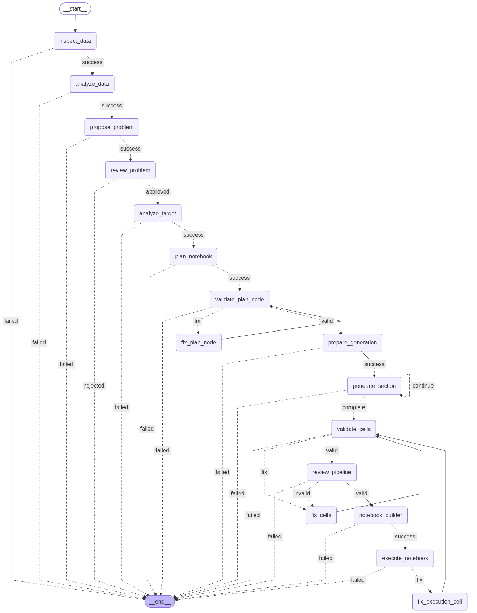

# QIU — AI Machine Learning Notebook Agent

QIU is an AI-assisted application that analyzes a dataset, proposes a Machine Learning problem, generates a Jupyter Notebook section by section, validates the generated code, repairs detected errors, and executes the resulting notebook.

QIU is built as a workflow instead of one large LLM request. LangGraph controls the workflow, Python performs deterministic checks, and the user remains in control of important decisions such as the target column and problem type.

## What QIU does

Given a tabular dataset, QIU can:

- inspect the dataset with Python;
- ask an LLM to analyze the dataset;
- propose a target column and problem type;
- ask the user to approve, edit, or reject the proposal;
- analyze the confirmed target;
- create and validate an 8–10 section notebook plan;
- generate notebook sections one at a time;
- validate cell structure, syntax, and static dependencies;
- review the complete Machine Learning pipeline semantically;
- repair invalid cells when possible;
- build and execute a timestamped .ipynb file.

The application currently provides a Textual terminal user interface (TUI) and a qiu command-line entry point.

## Current status

The main workflow, first Human-in-the-Loop review, section generation, static validation, semantic pipeline review, notebook building, notebook execution, and runtime repair routing are implemented.

QIU still depends on an external LLM API. Generated code is not guaranteed to be correct for every dataset; validators and repair nodes reduce common errors but do not replace human review.

## Architecture

### Main graph

The graph is compiled with LangGraph's InMemorySaver. The TUI keeps the same graph configuration and thread_id when it resumes after a user decision.

### Human-in-the-Loop review

When QIU reaches review_problem, the graph calls LangGraph's interrupt(). The TUI provides three actions:

- Approve — accept the proposed target and problem type.
- Edit — change the target column or choose regression/classification.
- Reject — stop the workflow.

The decision is sent back with:

~~~python
Command(resume=decision)
~~~

The same thread_id must be used to resume the graph correctly.

## Notebook generation

QIU generates sections separately instead of asking the LLM to generate the entire notebook in one response:

~~~text
NotebookPlan
    |
    +--> section_1 --> save to state
    +--> section_2 --> save to state
    +--> section_3 --> save to state
    +--> ...
    +--> section_n --> save to state
~~~

prepare_generation initializes section-generation state once. generate_section processes one section at a time while preserving cells already stored in state["notebook_cells"].

A generated cell has this general shape:

~~~json
{
  "cell_id": "section_4_code_1",
  "section_id": "section_4",
  "cell_type": "code",
  "title": "Train/test split",
  "source": "X_train, X_test, y_train, y_test = ...",
  "purpose": "Split the features and target",
  "expected_output": null
}
~~~

Only code-cell context from previous sections is sent to later section-generation calls. This keeps context smaller while preserving variable continuity.

### Variable contract

The generator is instructed to preserve common variables such as:

~~~python
df
target_column
X
y
X_train
X_test
y_train
y_test
preprocessor
trained_models
predictions
model_results
RANDOM_STATE
~~~

The exact variables depend on the dataset and notebook plan. The contract is a consistency guide, not a guarantee that every variable appears in every notebook.

## Validation and repair

### Notebook plan validation

The plan validator checks that the plan contains 8–10 sections, section IDs follow section_1, section_2, and so on, IDs are unique and ordered, every section has 1–5 tasks, and the target/problem type are unchanged.

Invalid plans are sent to fix_plan_node with the old plan and the collected errors.

### Cell and dependency validation

The deterministic cell validator checks required fields, duplicate IDs, valid cell types (markdown or code), non-empty string sources, code fences inside code cells, and Python syntax errors.

The dependency validator uses Python's ast module to process code cells in execution order. It tracks imports, variables, functions, and classes to detect common errors such as using a variable before it has been defined.

Static validation cannot prove that a library is installed or that a model receives data with a compatible runtime shape.

### Semantic pipeline review

After deterministic cell validation succeeds, review_pipeline sends the dataset context, problem definition, notebook plan, and all code cells to an LLM. It focuses on data leakage, train/test preprocessing, pandas/NumPy compatibility, variable consistency, model and metric usage, target consistency, and model comparison logic.

Only code cells are sent to this reviewer to reduce context size and token usage.

### Runtime repair

After building, QIU executes the notebook with nbclient. If execution fails and the failing code cell can be identified, fix_execution_cell receives the traceback, current cell, previous code cells, and available variable names.

The node makes a minimal repair and sends the notebook back through validation, pipeline review, building, and execution. The current execution repair limit is four attempts.

## Model providers and structured output

Provider and model choices are defined in config/providers.py. The current provider list includes OpenAI, Anthropic, Google Gemini, Groq, OpenRouter, Mistral, Together AI, NVIDIA NIM, Cerebras, Fireworks AI, DeepSeek, xAI, Cohere, and Perplexity.

QIU uses a model capability registry and a unified structured-output gateway:

~~~text
Provider + model
        |
Model capability profile
        |
Function calling / JSON mode / prompt parser
        |
JSON extraction
        |
Pydantic validation
~~~

Supported OpenAI-compatible profiles can use function calling. DeepSeek V4 profiles use prompt-based JSON generation because they do not use tool choice or native structured output in this application. DeepSeek thinking is disabled by the model runtime profile.

Unknown provider/model combinations fall back to the prompt-parser strategy.

## Installation from Git

### Requirements

- Python 3.11 or newer.
- Python 3.11–3.13 are recommended for the current dependency set.
- An API key for one supported LLM provider.
- A terminal that supports the Textual TUI.

Python 3.14 may work for some dependencies, but it is not the recommended release target until every dependency is confirmed to support it.

### Windows PowerShell

~~~powershell
git clone https://github.com/quang2365/ml_notebook_agent.git
Set-Location ml_notebook_agent

py -3.11 -m venv .venv
.\.venv\Scripts\Activate.ps1

python -m pip install --upgrade pip
python -m pip install .
~~~

If PowerShell blocks activation, call the venv executable directly:

~~~powershell
.\.venv\Scripts\qiu.exe setup
.\.venv\Scripts\qiu.exe
~~~

### Linux/macOS

~~~bash
git clone https://github.com/quang2365/ml_notebook_agent.git
cd ml_notebook_agent

python3.11 -m venv .venv
source .venv/bin/activate

python -m pip install --upgrade pip
python -m pip install .
~~~

### Development installation

For development and testing:

~~~bash
python -m pip install -e ".[dev]"
~~~

Editable installation means that changes in the cloned source are immediately used by the qiu command.

## First-time configuration

Run the interactive setup:

~~~bash
qiu setup
~~~

The setup flow asks for the provider, model, API key, and confirmation. The provider/model configuration is saved under ~/.qiu/config.json.

The API key is stored in the operating system keyring under the qiu service. API keys are not written to the Git repository.

An optional .env file can provide a key before setup:

~~~env
NVIDIA_API_KEY=your_nvidia_key
DEEPSEEK_API_KEY=your_deepseek_key
~~~

## Running QIU

After configuration:

~~~bash
qiu
~~~

The TUI displays the selected provider and model, dataset selection, current workflow node, generated section count, repair counts, validation status, pipeline review status, notebook output path, and execution status.

Select a dataset, press Start, and wait for the review screen. After approving or editing the proposal, QIU resumes the same graph session.

## CLI commands

~~~text
qiu                  Start the TUI
qiu setup            Configure provider, model, and API key
qiu change-config    Choose a saved configuration
qiu rm-config        Remove the saved configuration file
qiu version          Print the QIU version
qiu message -m ...  Send a simple message through the configured model
~~~

The message command is a basic connectivity check; it does not run the notebook workflow.

## Output files

The notebook builder creates a unique path using the dataset name, target column, and timestamp:

~~~text
output/<dataset>_<target>_<timestamp>.ipynb
~~~

For example: output/housing_median_house_value_20260821_143000.ipynb.

The notebook is written before execution and updated with execution outputs after a successful run. The output directory is created automatically.

## Testing

The test suite is designed to run offline. LLM-dependent tests use fake model responses instead of making API requests.

Run all tests:

~~~bash
python -m unittest discover -s test -p "test_*.py" -v
~~~

The suite covers model profiles, structured-output parsing, offline LLM nodes, section generation, notebook building, static validation, pipeline review, repair routing, notebook execution, runtime repair, and full graph integration.

To avoid creating Python bytecode during a clean run on PowerShell:

~~~powershell
$env:PYTHONDONTWRITEBYTECODE = "1"
python -m unittest discover -s test -p "test_*.py"
~~~

## Building a distributable package

The project uses pyproject.toml and setuptools.

~~~bash
python -m pip install -e ".[dev]"
python -m build
~~~

Artifacts are written to dist/:

~~~text
dist/qiu-<version>-py3-none-any.whl
dist/qiu-<version>.tar.gz
~~~

Install a wheel on another machine:

~~~bash
python -m pip install qiu-<version>-py3-none-any.whl
qiu setup
qiu
~~~

The package does not contain API keys, user configuration, datasets, generated notebooks, or the local virtual environment.

## Project structure

~~~text
ml_notebook_agent/
├── graph.py                         # LangGraph workflow
├── state.py                         # Shared state and initial state
├── pyproject.toml                   # Package metadata and dependencies
├── README.md
├── cli/                             # qiu commands
├── TUI/                             # Textual screens and dashboard
├── config/                          # providers and persisted config
├── security/                        # OS keyring access
├── model/                           # model runtime and structured gateway
├── nodes/                           # workflow nodes
├── route/                           # conditional routers
├── schemas/                         # Pydantic schemas
├── validators/                      # deterministic validators
├── tools/                           # dataset and cell helpers
├── test/                            # offline and integration tests
├── data/                            # local datasets, not packaged
└── output/                          # generated notebooks, not packaged
~~~

## Important state fields

| Group | Important fields |
| --- | --- |
| Dataset | dataset_path, summary, summary_llm |
| Human review | problem_proposal, target_column, problem_type, approval_status, user_feedback |
| Plan | notebook_plan, plan_validation_status, plan_validation_errors, fix_plan_attempts |
| Generation | notebook_cells, section_generation_status, current_section_index, generated_section_ids, section_retry_attempts |
| Cell validation | validation_cell_status, validation_cell_errors, fix_cell_attempts, fixed_cell_ids, fix_cell_failures |
| Pipeline review | pipeline_review_status, pipeline_review_errors, pipeline_fix_attempts |
| Build | notebook_path, build_status, build_error |
| Execution | execution_status, execution_error, execution_attempts, execution_fix_attempts |
| Global | messages, error |

The plan, cell, pipeline, and execution counters are separate so that one repair loop does not consume another loop's retry budget.

## Troubleshooting

### qiu is not recognized

Activate the virtual environment or call its executable directly:

~~~powershell
.\.venv\Scripts\Activate.ps1
qiu
~~~

### QIU says it is not configured

Run qiu setup.

### API key not found

Run qiu setup again and enter the key for the selected provider. The key is local to the current user and machine because it is stored in the OS keyring.

### DeepSeek returns tool_choice or response_format errors

Check that the provider is deepseek and the model name is correct. DeepSeek V4 profiles use prompt-parser JSON output and disable thinking/tool choice in the runtime.

### The workflow stops after validation

Inspect pipeline_review_status, pipeline_review_errors, error, and notebook_path in the TUI summary. A semantic error is routed to fix_cells; an LLM or routing failure ends the graph and is shown as a workflow error.

### The notebook fails during execution

Open the generated .ipynb and inspect the failing cell and traceback. QIU can attempt a runtime repair only when nbclient identifies a code cell. Missing third-party libraries or dataset-specific assumptions may require manual changes.

## Security notes

- Never commit .env or API keys.
- API keys are stored with the operating-system keyring.
- User configuration is stored under ~/.qiu.
- Generated notebooks may contain dataset paths and model outputs; review them before sharing.
- Generated Python code should be reviewed before use with sensitive data.

## Design principles

- Human control: the user confirms the target and problem type.
- Small LLM requests: sections are generated independently to control context size and rate limits.
- Structured output: model responses are parsed and validated with Pydantic.
- Deterministic checks first: Python checks syntax and basic dependencies before semantic review.
- Repair instead of full regeneration: the workflow attempts minimal cell-level repairs.
- Explicit state: each repair loop has its own status, errors, and attempt counter.
- No secrets in source: credentials are stored outside the repository.

## Known limitations

- QIU requires network access to the selected LLM provider.
- LLM responses can still be incomplete or incorrect.
- AST dependency validation cannot prove runtime compatibility.
- Semantic pipeline review is probabilistic and may miss a problem or report a false positive.
- Notebook execution depends on the local Python environment and installed packages.
- The current checkpointer is in-memory and intended for the active application session.
- A standalone .exe installer is not currently provided.

## License

No license file has been added yet. Add an explicit license before distributing QIU publicly.

## Learning goals

QIU is also a practical project for studying Python packaging, LangChain, LangGraph, Human-in-the-Loop workflows, structured LLM output, static Python analysis, Jupyter notebook generation, execution, and AI-assisted debugging.
